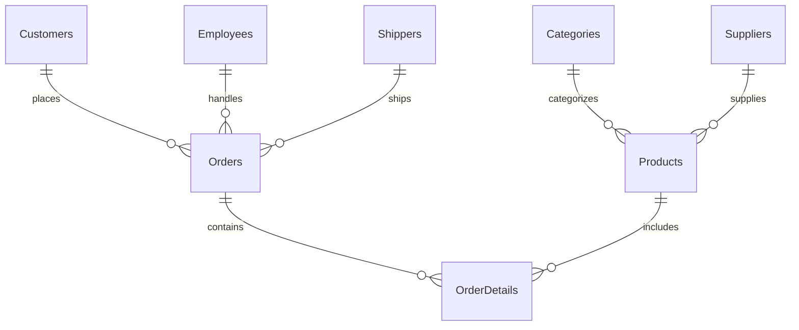

# Data Warehousing & Business Intelligence Project


A comprehensive educational project demonstrating the complete journey from traditional OLTP (Online Transaction Processing) database design to modern OLAP (Online Analytical Processing) data warehouse implementation for business intelligence analytics.

## 📖 Project Overview

This repository contains two distinct laboratory exercises that showcase the evolution from operational databases to analytical data warehouses:

- **LAB03**: Traditional OLTP Database Implementation (Northwind-style)
- **lab5**: Data Warehouse & Business Intelligence Implementation

## 🎯 Learning Objectives

- Understand the differences between OLTP and OLAP systems
- Learn database normalization and denormalization techniques
- Implement dimensional modeling and star schema design
- Practice ETL (Extract, Transform, Load) processes
- Develop business intelligence queries and analytics
- Master SQL Server integration with Python

## 🏗️ Project Structure

```
Data-Warehousing-Business-Intelligence/
├── LAB03/                          # OLTP Database Implementation
│   ├── *.csv                       # Source data files (Categories, Products, Orders, etc.)
│   ├── creatingtables.py           # Database schema creation
│   ├── *Data.py                    # Data loading scripts
│   ├── INDEXES.txt                 # Database indexing strategies
│   └── hard.py                     # Advanced operations
├── lab5/                           # Data Warehouse Implementation
│   ├── datawarehouse.py            # DW schema creation (star schema)
│   ├── LAB5_data.txt               # Sample data insertions
│   └── QUERIES.txt                 # Business intelligence queries
├── README.md                       # Project documentation (this file)
├── SETUP.md                        # Quick setup guide
└── test_setup.py                   # Environment validation script
```

## 🔧 Technologies Used

- **Database**: Microsoft SQL Server
- **Programming Language**: Python 3.x
- **Libraries**: 
  - `pyodbc` - SQL Server connectivity
  - `pandas` - Data manipulation and analysis
- **Design Patterns**: 
  - Star Schema (Data Warehouse)
  - Normalized Schema (OLTP)

## 📋 Prerequisites

### Software Requirements
- Microsoft SQL Server (Express/Developer/Standard)
- Python 3.7+
- SQL Server Management Studio (SSMS) - recommended

### Python Dependencies
```bash
pip install pyodbc pandas
```

### Database Setup
1. Install SQL Server and create two databases:
   - `lab03` (for OLTP implementation)
   - `nwdatawarehouse` (for data warehouse implementation)

2. Configure SQL Server to allow trusted connections

## 🚀 Getting Started

> **Quick Start**: See [SETUP.md](SETUP.md) for a step-by-step setup guide and [test_setup.py](test_setup.py) to validate your environment.

### LAB03: OLTP Database Implementation

#### 1. Database Schema Creation
```bash
cd LAB03
python creatingtables.py
```

This creates a normalized database with the following tables:
- **Customers** - Customer information
- **Suppliers** - Supplier details
- **Categories** - Product categories
- **Products** - Product catalog
- **Employees** - Employee records
- **Orders** - Order headers
- **OrderDetails** - Order line items
- **Shippers** - Shipping companies
- **Regions & Territories** - Geographic data

#### 2. Data Loading
Load data from CSV files into the database:
```bash
python CategoriesData.py
python CustomersData.py
python ProductsData.py
python OrdersData.py
# ... continue with other data loading scripts
```

#### 3. Index Creation
Apply database indexes for optimal query performance:
```sql
-- Execute the commands in INDEXES.txt in SSMS
```

### lab5: Data Warehouse Implementation

#### 1. Data Warehouse Schema Creation
```bash
cd lab5
python datawarehouse.py
```

This creates a star schema with:

**Dimension Tables:**
- `Customer` - Customer dimension with surrogate keys
- `Product` - Product dimension
- `Employee` - Employee dimension
- `Time` - Time dimension with date hierarchies
- `Supplier` - Supplier dimension
- `Category` - Category dimension
- `Geography` (City, State, Country, Continent) - Geographic dimensions

**Fact Table:**
- `Sales` - Central fact table containing measures and foreign keys

#### 2. Sample Data Population
Load sample data for testing and analysis:
```sql
-- Execute the INSERT statements in LAB5_data.txt
```

#### 3. Business Intelligence Queries
Execute analytical queries for business insights:
```sql
-- Execute queries from QUERIES.txt for:
-- Q1: Year-over-year sales comparison by state and month
-- Q2: Month-over-month product sales growth
-- Q3: Top 3 performing employees by sales
```

## 📊 Database Schemas

### LAB03: OLTP Schema (3NF Normalized)



### lab5: Data Warehouse Schema (Star Schema)

```mermaid
erDiagram
    Sales {
        int CustomerKey FK
        int EmployeeKey FK
        int ProductKey FK
        int SupplierKey FK
        int OrderDateKey FK
        int DueDateKey FK
        int ShippedDateKey FK
        int ShipperKey FK
        decimal SalesAmount
        decimal Freight
        int Quantity
        decimal Discount
    }
    
    Customer ||--o{ Sales : ""
    Employee ||--o{ Sales : ""
    Product ||--o{ Sales : ""
    Time ||--o{ Sales : ""
    Supplier ||--o{ Sales : ""
```



## 📈 Business Intelligence Use Cases

### Key Performance Indicators (KPIs)
- **Sales Performance**: Track revenue trends over time
- **Employee Productivity**: Identify top-performing sales representatives
- **Product Analysis**: Monitor product category performance
- **Geographic Analysis**: Analyze sales by region and territory
- **Customer Segmentation**: Understand customer buying patterns

### Sample Data Overview

The project includes real-world business data:

**Categories** (LAB03/Categories.csv):
```
CategoryID | CategoryName  | Description
1          | Beverages     | Soft drinks, coffees, teas, beers, and ales
2          | Condiments    | Sweet and savory sauces, relishes, spreads
3          | Confections   | Desserts, candies, and sweet breads
```

**Products** (LAB03/Products.csv):
```
ProductID | ProductName | SupplierID | CategoryID | Unit              | Price
1         | Chais       | 1          | 1          | 10 boxes x 20 bags| 18
2         | Chang       | 1          | 1          | 24 - 12 oz bottles| 19
```

### Sample Analytical Queries

#### Year-over-Year Sales Comparison
```sql
SELECT 
    State, Month, CurrentYear,
    CurrentYearSales, PreviousYearSales,
    (CurrentYearSales - PreviousYearSales) AS SalesDifference
FROM Sales_Analysis_View
ORDER BY State, CurrentYear, Month;
```

#### Product Sales Growth
```sql
SELECT 
    ProductName, Year, CurrentMonth,
    CurrentMonthSales, PreviousMonthSales,
    ((CurrentMonthSales - PreviousMonthSales) / PreviousMonthSales) * 100 AS GrowthPercentage
FROM Product_Growth_Analysis;
```

## 🔧 Configuration

### Database Connection Settings

**LAB03 Configuration:**
```python
conn = pyodbc.connect(
    'Driver={SQL Server};'
    'Server=YOUR_SERVER_NAME;'
    'Database=lab03;'
    'Trusted_Connection=yes;'
)
```

**lab5 Configuration:**
```python
conn = pyodbc.connect(
    "Driver={ODBC Driver 17 for SQL Server};"
    "Server=YOUR_SERVER_NAME;"
    "Database=nwdatawarehouse;"
    "Trusted_Connection=yes;"
)
```

## 🧪 Testing Your Setup

### Quick Validation
```bash
# Test database connections
python test_setup.py

# Verify Python dependencies
python -c "import pyodbc, pandas; print('Dependencies OK!')"
```

### Data Validation
1. Verify table creation and data loading
2. Check referential integrity constraints
3. Validate data quality and completeness
4. Test query performance

### Sample Validation Queries
```sql
-- Check row counts
SELECT COUNT(*) FROM Customers;
SELECT COUNT(*) FROM Sales;

-- Verify data integrity
SELECT * FROM Sales WHERE CustomerKey NOT IN (SELECT CustomerKey FROM Customer);

-- Performance testing
SET STATISTICS IO ON;
SELECT * FROM Sales WHERE OrderDateKey BETWEEN 1 AND 365;
```

## 📝 Best Practices Implemented

### Database Design
- **OLTP**: Third Normal Form (3NF) for data integrity
- **OLAP**: Star schema for analytical performance
- **Indexing**: Strategic index placement for query optimization
- **Constraints**: Foreign key relationships and data validation

### Data Management
- **ETL Process**: Structured data extraction and loading
- **Data Quality**: Validation and cleansing procedures
- **Surrogate Keys**: Stable dimension key management
- **Time Dimension**: Comprehensive date hierarchies

### Performance Optimization
- **Indexing Strategy**: Primary and secondary indexes
- **Query Optimization**: Efficient join operations
- **Partition Strategy**: Time-based data organization
- **Aggregation Tables**: Pre-calculated summaries

## 🤝 Contributing

1. Fork the repository
2. Create a feature branch (`git checkout -b feature/improvement`)
3. Commit changes (`git commit -am 'Add new feature'`)
4. Push to branch (`git push origin feature/improvement`)
5. Create a Pull Request

## 📚 Additional Resources

- [Microsoft SQL Server Documentation](https://docs.microsoft.com/en-us/sql/)
- [Dimensional Modeling Techniques](https://www.kimballgroup.com/)
- [Python pyodbc Documentation](https://pypi.org/project/pyodbc/)
- [Pandas Documentation](https://pandas.pydata.org/docs/)

## 📄 License

This project is licensed under the MIT License - see the [LICENSE](LICENSE) file for details.

## 🙏 Acknowledgments

- Inspired by the classic Northwind database
- Educational materials from data warehousing courses
- Microsoft SQL Server community best practices
- Kimball Group dimensional modeling methodologies

---

**Note**: This project is designed for educational purposes to demonstrate data warehousing concepts and business intelligence implementations. Update the database connection strings with your specific SQL Server instance details before running the scripts.